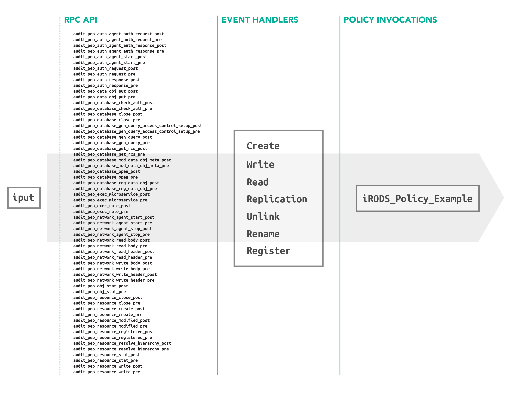

# Motivation

The process for creating and deploying policy for iRODS requirest the rule author to have a complete understanding of the API for iRODS as well as the associated plugin architecture in order to properly leverage the dynamic policy enforcement.  The author will also need to trigger the same policy in multiple ways in order to cover all possible means to move data into iRODS for both object and POSIX data movement.  The goal of this framework is to streamline the craft and deployment of policy, as well as provide a reusable body of policy that may be easily configured.  Policy should now be a matter of configuration and not specifically crafted code which may follow a documented means of deployment for most use cases.

## Event Handlers

Event handlers are a classification of rule engine plugin which consume dynamic policy enforcement points related to a noun within iRODS and invoke policy configured for events generated by the plugin.  There will exist one event handler per noun in the system, the first two of which are Data Objects and Metadata.

The complete list is:
* Data Objects
* Collections
* Metadata
* Resources
* Users and Groups

The Data Object event handler unifies both the Object and POSIX semantics, as well as other iRODS specific operations such as registration, into a single point of truth for invoking policy related to data access.  The plugin maps policy enforcement points to specific set of event for which policy may be configured.  For example:

```cpp
 pep_api_bulk_data_obj_put_pre        "CREATE"
 pep_api_data_obj_chksum_pre          "CHECKSUM"
 pep_api_data_obj_copy_pre            "COPY"
 pep_api_data_obj_create_and_stat_pre "CREATE"
 pep_api_data_obj_create_pre          "CREATE"
 pep_api_data_obj_get_pre             "GET"
 pep_api_data_obj_lseek_pre           "SEEK"
 pep_api_data_obj_phymv_pre           "REPLICATION"
 pep_api_data_obj_put_pre             "PUT"
 pep_api_data_obj_rename_pre          "RENAME"
 pep_api_data_obj_repl_pre            "REPLICATION",
 pep_api_data_obj_trim_pre            "TRIM"
 pep_api_data_obj_truncate_pre        "TRUNCATE"
 pep_api_data_obj_unlink_pre          "UNLINK"
 pep_api_phy_path_reg_pre             "REGISTER"
```



The policy to be invoke is a matter of the plugin specific configuration within `/etc/irods/server_config.json` for a given instance of an event handler.  The "plugin_specific_configuration" object for the given instance will look for a JSON array "policies_to_invoke", which itself is a series of JSON objects.  These objects are the configuration of a policy to invoke for a given series of events.  The policy objects contain:
* conditional
* active_policy_clauses
* events
* policy

### Conditional
A conditional describes a set of conditions which must be met in order to invoke the policy.  These are a series of regular expressions which match the nouns involved.  This could be the `logical_path`, `metadata`, `user_name`, `source_resource`, or `destination_resource`.  A compete example might be:

```json
"conditional" : {
    "logical_path" : "/tempZone/home/*",
    "metadata" : {
        "attribute" : "foo*",
        "value" : "bar*",
        "units" : "baz*",
        "entity_type" : "data_object"
    },
    "source_resource" : "src*",
    "destination_resource" : "dest*"
}
```

The "entity_type" for the metadata maps to the iRODS nouns which are: "data_object", "collection", "resource", and "user".

### Active Policy Clauses
"active_policy_clauses" is configured as a JSON array of one or more of the following: `"pre", "post", "except", "finally"` which map to which dynamic policy enforcement points are triggered in the operation flow.

### Events
"events" is also configured as a JSON array of strings which map to the events generated by the event handler.  For the data object modified event handler an event may be on or more of the following `"create", "checksum", "copy", "get", "seek", "replication", "put", "rename", "trim", "truncate", "unlink", "register"`

###
"policy" is a JSON string which is the name of the policy to invoke.  Following the "policy" is a "configuration" object which contains any specific information related to that given policy.

## Example Configuration :: Synchronous Replication
```JSON
{
    "instance_name": "irods_rule_engine_plugin-event_handler-data_object_modified-instance",
    "plugin_name": "irods_rule_engine_plugin-event_handler-data_object_modified",
    "plugin_specific_configuration": {
        "policies_to_invoke" : [
            {
                "conditional" : {
                    "logical_path" : "\/tempZone.*"
                },
                "active_policy_clauses" : ["post"],
                "events" : ["create", "write", "registration"],
                "policy" : "irods_policy_data_replication",
                "configuration" : {
                    "source_to_destination_map" : {
                        "edge_resource_0" : ["long_term_resource_0"],
                        "edge_resource_1" : ["long_term_resource_1"],
                    }
                }
            },
            {
                "conditional" : {
                    "logical_path" : "\/tempZone.*"
                },
                "active_policy_clauses" : ["pre"],
                "events" : ["get"],
                "policy" : "irods_policy_data_replication",
                "configuration" : {
                    "source_to_destination_map" : {
                        "long_term_resource_0" : ["edge_resource_0"],
                        "long_term_resource_1" : ["edge_resource_1"]                      
                    }
                }
            }
        ]
    }
}
```
